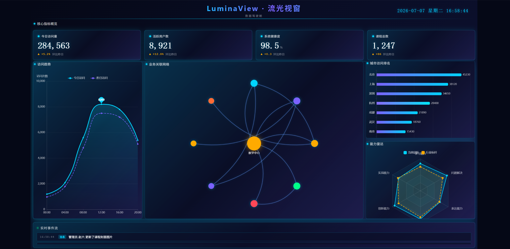

# LuminaView · 流光视窗

> 教育行业综合运营数据指挥大屏，面向教务/运营管理人员的全局教学数据实时监控。

LuminaView（流光视窗）是一个以**教学数据中心**为场景的数据可视化大屏项目，深色科技驾驶舱风格，用于集中展示核心业务指标、访问趋势、课程分布、业务关联网络、城市访问排名与能力评估，并配套实时事件流，适配远距离大屏观看与日常运营监控。

## ✨ 特点

- 📊 **业务导向**：围绕教学数据中心设计 KPI、趋势、占比、关联网络、排名与雷达。
- 🎨 **统一视觉**：深海藏青 + 荧光青蓝主色调，发光边框、轻量化渐变与统一菱形标识。
- 🧩 **模块化拆分**：核心指标、趋势分析、分类占比、业务关联、城市排名、能力评估、实时事件，清晰分区。
- 📐 **全屏适配**：固定 1920×1080 设计稿，等比缩放居中布局，无横向/纵向溢出。

## 🛠 技术栈

| 方向 | 选型 |
| --- | --- |
| 基础 | Vue 3 + TypeScript + Vite |
| 状态管理 | Pinia |
| 可视化 | ECharts + vue-echarts |
| 测试 | Vitest、Playwright |
| 代码规范 | ESLint + Prettier |
| 数据 | Mock 接口，支持接入真实后端 |

## 🚀 快速开始

```bash
git clone https://github.com/ffwy1137/LuminaView.git
cd LuminaView
npm install
npm run dev
```

构建预览：

```bash
npm run build
npm run preview
```

也可以直接打开浏览器访问 Vite 输出的本地地址（通常是 `http://localhost:5173`）。

## 📁 目录结构

```
LuminaView/
├── index.html                   # 入口 HTML
├── package.json                 # 项目依赖与脚本
├── vite.config.ts               # Vite 配置（含 Mock 插件与路径别名）
├── src/
│   ├── main.ts                  # 应用入口
│   ├── App.vue                  # 根组件（全屏缩放布局）
│   ├── assets/
│   │   └── styles/              # 全局样式与 CSS 变量
│   ├── modules/
│   │   ├── header/              # 顶部标题与时钟
│   │   ├── overview/            # 核心指标概览
│   │   ├── trend/               # 访问趋势折线图
│   │   ├── categories/          # 课程分类占比环形图
│   │   ├── map/                 # 业务关联网络图
│   │   ├── ranking/             # 城市访问排名柱状图
│   │   ├── capabilities/        # 能力雷达图
│   │   └── realtime/            # 实时事件流
│   ├── shared/
│   │   └── components/          # 通用光效边框等组件
│   ├── stores/                  # Pinia 数据状态
│   ├── services/                # API 层
│   ├── types/                   # TypeScript 类型定义
│   ├── utils/                   # 工具函数（缩放适配、日志等）
│   ├── mock/                    # Mock 数据与接口
│   └── vite-env.d.ts            # Vite 类型声明
└── tests/
    ├── unit/                    # 单元测试
    └── e2e/                     # E2E 测试（Playwright）
```

## 📌 脚本说明

```bash
npm run dev        # 启动开发服务器（默认端口 5173）
npm run build      # 类型检查 + 生产构建
npm run preview    # 预览生产构建产物
npm run lint       # ESLint 检查
npm run format     # Prettier 格式化
npm test           # Vitest 单测
npm run test:watch # 单测监听模式
npm run test:e2e   # Playwright E2E
```

## 📸 预览



## 📄 许可证

本项目基于 [MIT 许可证](./LICENSE) 开源，可自由学习、修改与分享。

## 🤝 贡献

欢迎提交 Issue 或 Pull Request 完善数据源、图表交互、视觉细节与测试用例。
